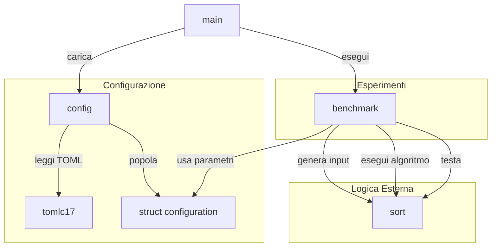

# algoritmi-ordinamento-2026
Laboratorio di programmazione del corso di Algoritmi e Strutture Dati dell'Università degli Studi di Ferrara, anno scolastico 2025-2026.

# Documentazione

```mermaid
flowchart TB

    MAIN["main"]

    subgraph Configurazione
        CONFIG["config"]
        TOML["tomlc17"]
        STRUCT["struct configuration"]
    end

    subgraph Esperimenti
        BENCH["benchmark"]
    end

    subgraph Logica Esterna
        SORT["sort"]
    end

    MAIN -->|carica| CONFIG
    CONFIG -->|leggi TOML| TOML
    CONFIG -->|popola| STRUCT

    MAIN -->|esegui| BENCH
    BENCH -->|usa parametri| STRUCT

    BENCH -->|genera input| SORT
    BENCH -->|esegui algoritmo| SORT
    BENCH -->|testa| SORT
```
