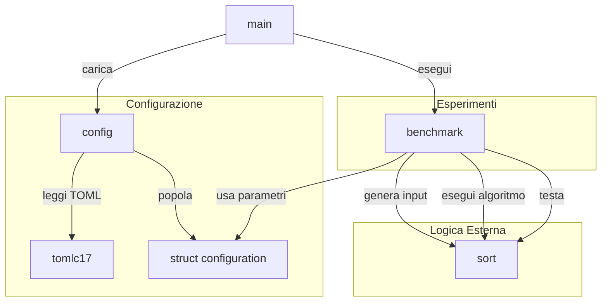
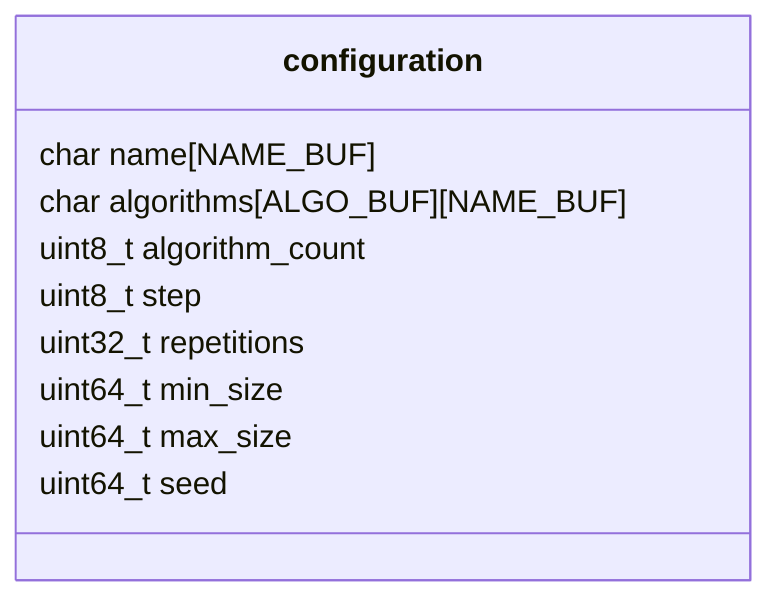
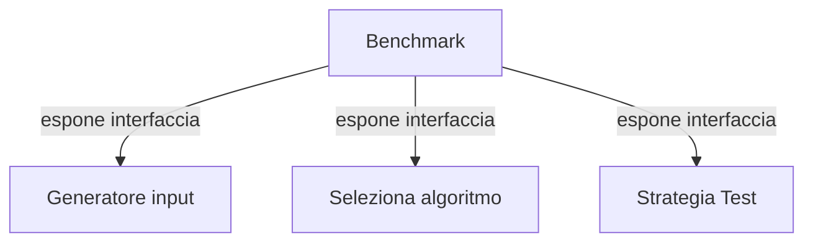
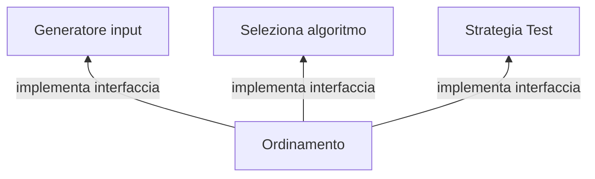

# algoritmi-ordinamento-2026
Laboratorio di programmazione del corso di Algoritmi e Strutture Dati dell'Università degli Studi di Ferrara, anno scolastico 2025-2026.

# Documentazione

La vista ad alto livello del progetto, si può riassumere con questo schema.

In particolare, il modulo `Configurazione` ha due responsabilità: definire la struttura di configurazione e caricarla.Un possibile esempio è di seguito.

Il `main` è il punto di accesso del programma, e orchestratore (driver) degli esperimenti.

Dopo aver letto da tastiera il percorso file da cui leggere la configurazione, ne delega il caricamento al modulo `Configurazione`, ottenendo una struttura (vedi sopra) da inoltrare al modulo degli `Esperimenti`.

Gli esperimenti si occupano di:
    1. iterare una lista di algoritmi di cui misurare le prestazioni;
    2. per ogni algoritmo, generare un input casuale;
    3. chiamare l'algoritmo misurandone il tempo di esecuzione;
    4. salvare il tempo misurato;
    5. controllare la correttezza dell'algoritmo;
    6. ripetere il punto 2 per quanto specificato dalla configurazione;
    7. restituire la media dei tempi di esecuzione.

Si noti che i punti 1., 2. e 5. del processo sopra, non conoscono a priori la logica da chiamare.

Si aggiunge dunque una responsabilità al modulo degli `Esperimenti`: quella di esporre tre interfacce.

Un modulo `Logica Esterna` si occupa esattamente di implementare queste interfacce. Nel corso, ci focalizziamo sul contesto degli ordinamenti.

